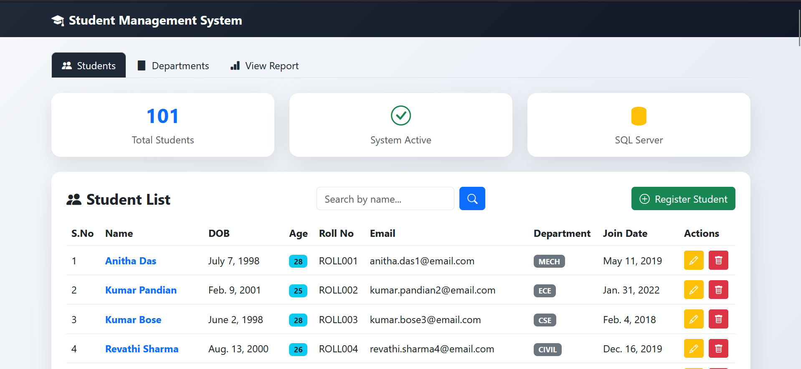
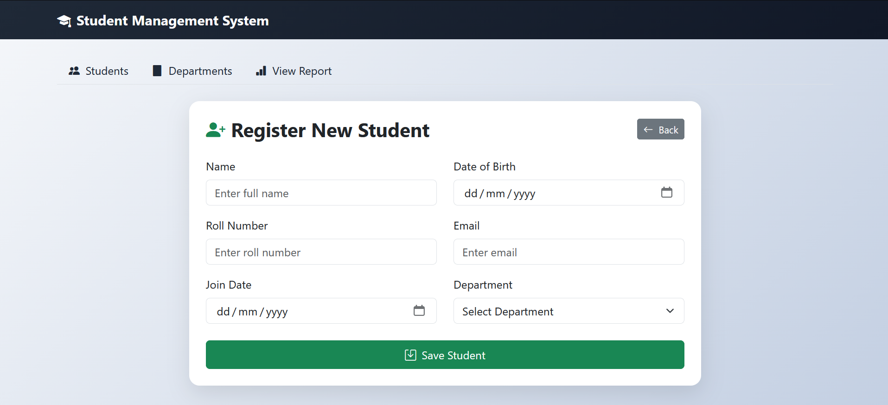
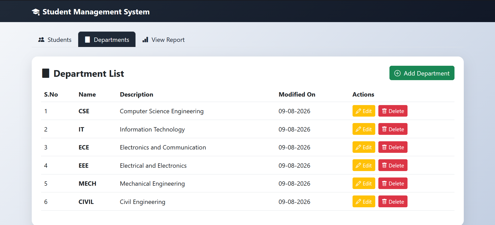
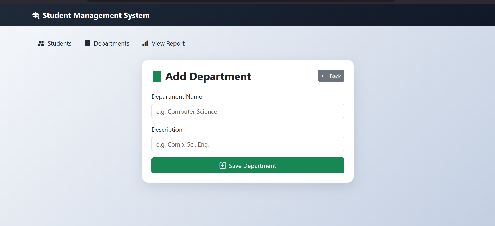
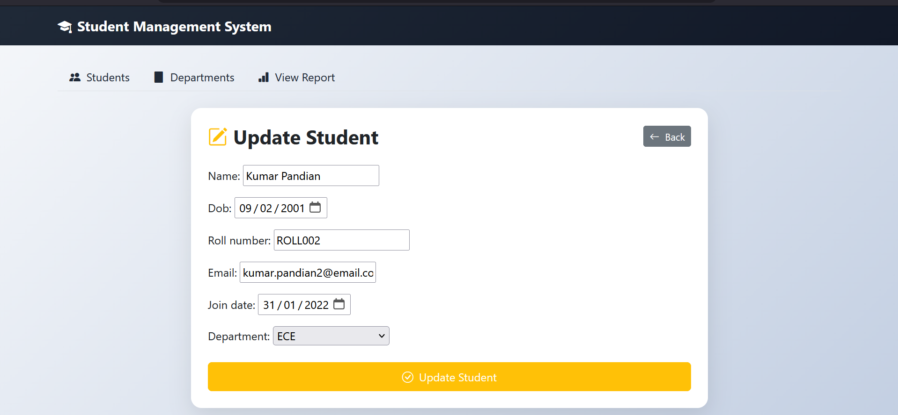
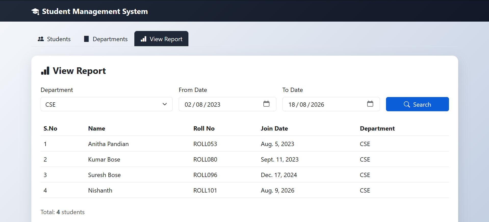
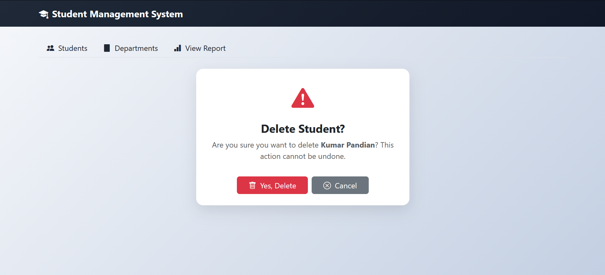

# Student Management System 🎓

A full-stack web application built with Python and Django for managing student records, departments, and administrative workflows.

## 🛠️ Tech Stack
- **Backend:** Python 3, Django
- **Database:** Microsoft SQL Server
- **Frontend:** HTML5, CSS3, Bootstrap 5, Django Templates

## ✨ Features
- ✅ Student CRUD (Create, Read, Update, Delete)
- ✅ Department Management with CRUD
- ✅ Auto Age Calculation from Date of Birth
- ✅ Live Search by student name
- ✅ View Report with Department + Date Range filter
- ✅ Foreign Key relationship (Student → Department)
- ✅ 3-tab navigation (Students, Departments, View Report)
- ✅ Bootstrap 5 responsive UI

## 📸 Screenshots

### Student List


### Register New Student


### Department List


### Add Department


### Update Student


### View Report


### Delete Student


## 🚀 Setup & Installation

1. Clone the repository:
```bash
git clone https://github.com/Nishanth4063/student_mgmt_system.git
cd student_mgmt_system
```

2. Set up virtual environment:
```bash
python -m venv venv
venv\Scripts\activate
```

3. Install dependencies:
```bash
pip install -r requirements.txt
```

4. Configure SQL Server in `student_mgmt/settings.py`

5. Run migrations:
```bash
python manage.py migrate
```

6. Generate sample data:
```bash
python generate_data.py
```

7. Start server:
```bash
python manage.py runserver
```

## 📁 Project Structure
```
student_mgmt_system/
├── students/          # Main app (models, views, forms, urls)
├── student_mgmt/      # Project settings and URL routing
├── assets/            # Screenshots
└── generate_data.py   # Sample data generator
```